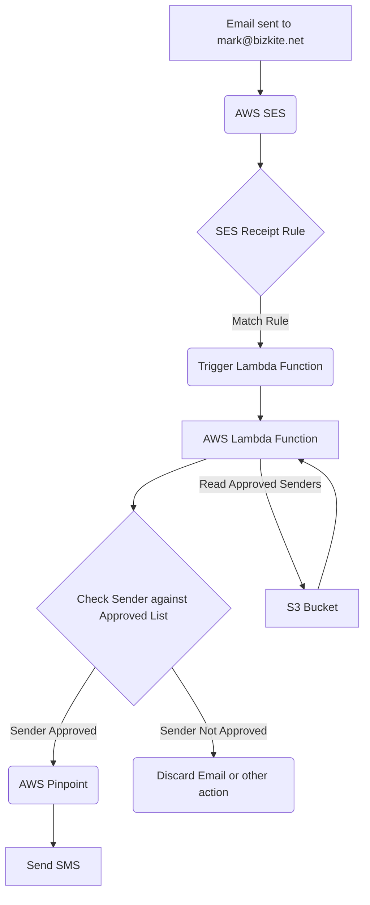

# Email to SMS Notification System Plan

**Project Goal:** Create an AWS CDK application to receive emails sent to `mark@bizkite.net`, check if the sender is on an approved list, and send an SMS notification via AWS Pinpoint if they are.

**Proposed Architecture:**

**Implementation Plan:**

1.  **Verify Domain in AWS SES:** Ensure that the domain `bizkite.net` is verified in your AWS SES account for receiving emails. This typically involves adding MX and TXT records to your domain's DNS configuration. (This is a prerequisite step you may need to perform manually if not already done).
2.  **Create New CDK Project:** Initialize a new AWS CDK project in the specified directory `/home/mstouffer/repos/email-to-sms`.
3.  **Define S3 Bucket for Approved Senders:** Create an S3 bucket using CDK. This bucket will store a file (e.g., `approved-senders.txt`) containing the list of email addresses allowed to trigger SMS notifications. Each email address should be on a new line.
4.  **Develop Lambda Function:** Write an AWS Lambda function (e.g., using Node.js or Python) that will:
    *   Be triggered by an SES email receiving event.
    *   Parse the SES event to extract the sender's email address.
    *   Read the `approved-senders.txt` file from the S3 bucket.
    *   Check if the extracted sender email address exists in the list from the S3 file.
    *   If the sender is found in the approved list, use the AWS SDK to send an SMS message via AWS Pinpoint to your registered phone number.
    *   Include basic logging to CloudWatch for monitoring and debugging.
5.  **Define IAM Role and Policies:** Create an IAM role for the Lambda function with necessary permissions:
    *   `ses:InvokeLambdaFunction` (allows SES to trigger the Lambda).
    *   `s3:GetObject` (allows the Lambda to read the approved senders file from the S3 bucket).
    *   `mobiletargeting:SendMessages` (allows the Lambda to send SMS via Pinpoint).
    *   Permissions to write logs to CloudWatch Logs.
6.  **Configure SES Receipt Rule Set and Rule:** Define an SES Receipt Rule Set and a Rule using CDK. This rule will:
    *   Specify the recipient `mark@bizkite.net`.
    *   Have an action to invoke the Lambda function created in step 4.
    *   (Optional) Include other actions like dropping spam or viruses before triggering the Lambda.
7.  **Integrate Pinpoint:** Ensure the Lambda function code correctly uses the AWS SDK to interact with your existing AWS Pinpoint project to send the SMS. You will need your Pinpoint Application ID and the target phone number configured in the Lambda function (e.g., via environment variables).
8.  **Address Pinpoint Debugging:** The plan will include steps for debugging SMS sending issues:
    *   Checking CloudWatch logs for errors in the Lambda function execution, particularly around the Pinpoint API call.
    *   Verifying your Pinpoint project settings, including SMS channel enablement and the target phone number's opt-in status.
    *   Using AWS CLI commands to test sending an SMS directly via Pinpoint outside of the Lambda to isolate issues.
9.  **CDK Deployment:** Outline the commands to synthesize and deploy the CDK stack to your AWS account.